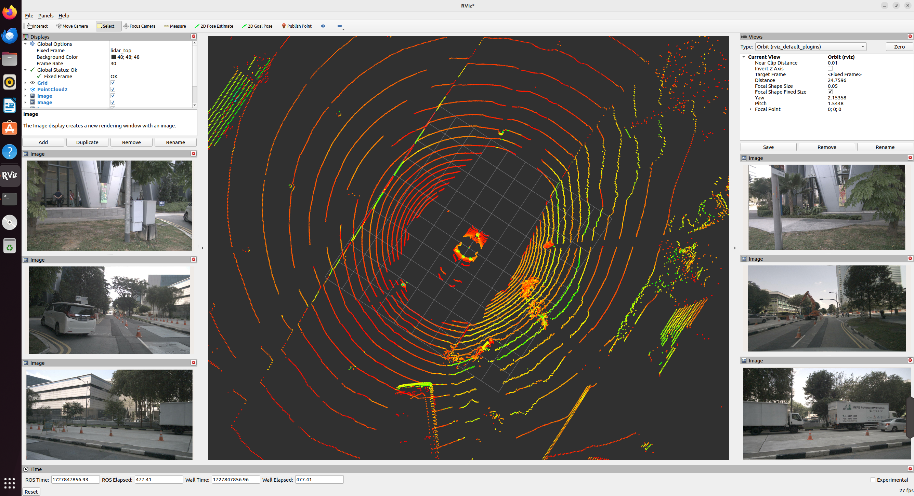

# Introduction
This repository is used to convert the nuScenes dataset into rosbag format, supporting the Humble version of ROS on Ubuntu-22.04. Thanks to https://github.com/clynamen/nuscenes2bag, I replaced some function libraries and data types based on this repository to support ROS2.

The tool loads the json metadata and then the sample files for each scene. The sample are converted in a suitable ROS2 msg and written to a bag. TF tree is also written.



## Start
### 1. Create the workspace and ROS2 package
```
mkdir your_ws_name
cd your_ws_name/
ros2 pkg create package_name --build-type ament_cmake --dependencies rclcpp std_msgs rosidl_default_generators sensor_msgs geometry_msgs tf2 tf2_msgs cv_bridge nav2_msgs rosbag2_cpp pcl_msgs pcl_ros pcl_conversions
```

### 2. Download the code and build the project
The tool is a normal ROS2 package. Place it under a workspace and build it with colcon. 
```
cd src/
git clone https://github.com/Wj-costumer/NuScenes2Bag_ROS2.git
cd ../..
colcon build 
```
You can modify the cmake file according to "nuscenes2bag/CMakeLists.txt".

### 3. Prepare dataset
You can download nuScenes dataset from https://www.nuscenes.org/ and organize your dataset as follows:
```
├── data/
│   ├── nuscenes/
│   │   ├── maps/
│   │   ├── samples/
│   │   ├── sweeps/
│   │   ├── v1.0-mini/
```

## Usage

**Command-line arguments:**
`--dataroot`: The path to the directory that contains the 'maps', 'samples' and 'sweeps'.
`--version`: (optional) The sub-directory that contains the metadata .json files. Default = "v1.0-mini"


**Converting the 'mini' dataset:**

Convert one scene to a bag file, saved in a new directory:
Scene '0061' will be saved to 'nuscenes_bags/61.bag'
```
ros2 run nuscenes2bag node_name --scene_number 0061 --dataroot /data/nuscenes --out nuscenes_bags/
```


Convert the entire dataset to bag files:
This processes 4 scenes simultaneously, however the scene numbers are not processed in numerical order.
```
ros2 run nuscenes2bag node_name --dataroot /data/nuscenes/ --out nuscenes_bags/ --jobs 4
```


## Status

Currently work in progress

- [x] Image support
- [x] Pointcloud support
- [x] Radar support
- [x] EgoPose and TF support
- [x] Show progress
- [ ] Better usability